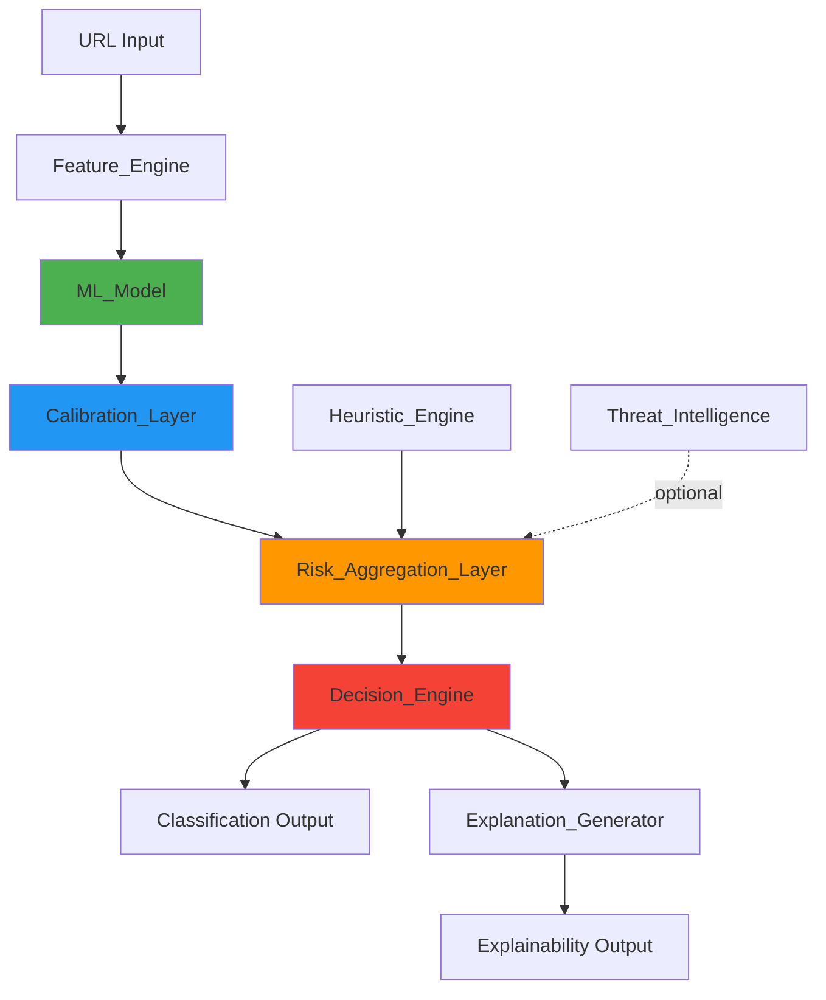

# Design Document: ML-First Unified Detection System

## Overview

This design document specifies the transformation of PhishLens from a fragmented heuristic-first architecture to an ML-first unified detection system. The new architecture positions machine learning as the primary decision engine, eliminates feature leakage, ensures offline-safe operation, and provides calibrated probability outputs with comprehensive explainability.

### Current State

The existing system suffers from several critical architectural issues:

1. **Fragmented Decision Logic**: ML models, heuristics, and threat intelligence operate independently with ad-hoc score combination
2. **Zero Recall in Offline Mode**: Network-dependent features (WHOIS, DOM analysis) cause complete classification failure when unavailable
3. **Feature Leakage**: Features like `impersonates_known_brand` and `has_phishing_keyword` encode label information
4. **Uncalibrated Probabilities**: Raw ML outputs don't reflect true likelihood, requiring manual calibration rules
5. **Evaluation-Production Mismatch**: Training uses balanced datasets while production sees 99/1 imbalance
6. **No Unified Artifact Pipeline**: Models are trained and deployed through inconsistent processes

### Target State

The ML-first architecture will:

1. **Unified Decision Flow**: ML_Model → Calibration_Layer → Risk_Aggregation_Layer → Decision_Engine
2. **Offline-Safe Features**: 16 features extracted purely from URL string analysis
3. **Leakage-Free Features**: Character-level entropy and structural metrics replace keyword matching
4. **Calibrated Probabilities**: Platt scaling or isotonic regression transforms raw outputs
5. **Realistic Evaluation**: 99/1 imbalance simulation with Precision-Recall AUC as primary metric
6. **Reproducible Pipeline**: Training_Pipeline → Model_Bundle → Inference_Engine with versioning

### Design Principles

1. **ML-First, Not ML-Only**: ML provides primary signal (70-90% weight), heuristics provide explanatory context (10-20% weight)
2. **Fail-Safe Behavior**: System fails conservatively (SUSPICIOUS classification) when ML inference fails
3. **Offline-First**: All core features work without network access; threat intelligence is optional enhancement
4. **Explainability by Design**: Every classification includes ML feature contributions + heuristic context
5. **Reproducibility**: Fixed random seeds, pinned dependencies, versioned artifacts

---

## Architecture

### System Components



### Component Responsibilities

#### Feature_Engine
- **Purpose**: Extract offline-safe features from URL strings
- **Input**: Raw URL string
- **Output**: 16-dimensional feature vector
- **Dependencies**: None (pure string analysis)
- **Location**: `backend/ai_engine/ml_feature_engine.py`

#### ML_Model
- **Purpose**: Produce phishing probability from feature vector
- **Input**: 16-dimensional feature vector
- **Output**: Raw probability [0, 1]
- **Algorithm**: Random Forest or XGBoost (selected via hyperparameter tuning)
- **Location**: `backend/models/url/ml_first_v{version}/model.pkl`

#### Calibration_Layer
- **Purpose**: Transform raw ML probability into calibrated probability
- **Input**: Raw probability [0, 1]
- **Output**: Calibrated probability [0, 1]
- **Algorithm**: Platt scaling (LogisticRegression) or isotonic regression
- **Location**: `backend/models/url/ml_first_v{version}/calibrator.pkl`

#### Risk_Aggregation_Layer
- **Purpose**: Combine calibrated ML probability with optional signals
- **Input**: Calibrated ML probability, heuristic signals, threat intelligence
- **Output**: Final risk score [0, 100]
- **Weighting**: ML 70-90%, Heuristics 10-20%, Threat Intel 0-10%
- **Location**: `backend/intelligence/risk_aggregator.py`

#### Decision_Engine
- **Purpose**: Map final risk score to classification label
- **Input**: Final risk score [0, 100]
- **Output**: Classification (SAFE, SUSPICIOUS, PHISHING)
- **Thresholds**: SAFE < 25, SUSPICIOUS 25-50, PHISHING ≥ 50
- **Location**: `backend/intelligence/decision_engine.py`

#### Explanation_Generator
- **Purpose**: Generate human-readable explanations
- **Input**: Feature contributions, heuristic signals, classification
- **Output**: Explanation text with top-5 contributing features
- **Location**: `backend/services/explanation_generator.py`

### Data Flow

```
1. URL → Feature_Engine → [f1, f2, ..., f16]
2. [f1, ..., f16] → ML_Model → raw_prob
3. raw_prob → Calibration_Layer → calibrated_prob
4. calibrated_prob + heuristics + threat_intel → Risk_Aggregation_Layer → final_score
5. final_score → Decision_Engine → classification
6. classification + feature_contributions → Explanation_Generator → explanation
```

### Failure Modes and Handling

| Failure Mode | Detection | Response | Classification |
|--------------|-----------|----------|----------------|
| ML_Model load failure | Model file missing | Log critical error, refuse to start | N/A (startup failure) |
| Feature extraction failure | Exception during feature computation | Use default feature values, log warning | SUSPICIOUS |
| ML inference failure | Exception during predict() | Log error, use conservative threshold | SUSPICIOUS |
| Calibration failure | Exception during calibration | Use uncalibrated probability with conservative threshold | Continue with warning |
| Heuristic failure | Exception in heuristic computation | Skip heuristic contribution, log warning | Continue (ML-only) |
| Threat intel failure | API timeout or error | Skip threat intel contribution, log info | Continue (ML-only) |

---

## Components and Interfaces

### Feature_Engine

#### Class: `MLFeatureEngine`

**Location**: `backend/ai_engine/ml_feature_engine.py`

**Purpose**: Extract 16 offline-safe features from URL strings without network dependencies.

**Interface**:
```python
class MLFeatureEngine:
    def extract(self, url: str) -> MLFeaturePack:
        """Extract features from URL string.
        
        Args:
            url: Raw URL string
            
        Returns:
            MLFeaturePack containing:
                - features: list[float] (16 elements)
                - feature_names: list[str] (16 elements)
                - extraction_metadata: dict
        """
        pass
```

**Feature Extraction Logic**:

1. **URL Length** (f1): `len(url)`
2. **Character Entropy** (f2): Shannon entropy of URL string
3. **Digit Ratio** (f3): `count(digits) / len(url)`
4. **Special Character Count** (f4): Count of `!@#$%^&*-_+=`
5. **Subdomain Count** (f5): Number of subdomain levels
6. **Path Depth** (f6): Number of `/` in path
7. **Query Parameter Count** (f7): Number of `&` + 1 if query exists
8. **TLD Category** (f8): 0=generic, 1=country-code, 2=suspicious
9. **Domain Token Count** (f9): Number of tokens in domain (split by `-`, `.`)
10. **Longest Token Length** (f10): Max length of domain tokens
11. **Vowel-Consonant Ratio** (f11): `count(vowels) / count(consonants)` in domain
12. **Homoglyph Risk Score** (f12): Count of visually similar characters (0, O, l, 1, etc.)
13. **HTTPS Usage** (f13): 1 if https, 0 otherwise
14. **IP Address Usage** (f14): 1 if hostname is IP, 0 otherwise
15. **Port Specification** (f15): 1 if non-standard port, 0 otherwise
16. **URL Entropy Normalized** (f16): Entropy / 5.0 (normalized to [0, 1])

**Dependencies**:
- `tldextract`: For TLD parsing
- `math`: For entropy calculation
- `re`: For pattern matching
- `urllib.parse`: For URL parsing

**Error Handling**:
- Malformed URLs: Return default feature vector (all zeros except f13=1 for https assumption)
- Missing components: Use safe defaults (e.g., empty path → path_depth=0)

---

### ML_Model

#### Model Selection

**Candidates**:
1. **Random Forest**: Robust to feature scaling, handles non-linear relationships, provides feature importance
2. **XGBoost**: Higher performance, better handling of imbalanced data, faster inference

**Selection Criteria**:
- Precision-Recall AUC on validation set (primary metric)
- Inference latency (target: < 10ms per URL)
- Model size (target: < 50MB)
- Feature importance interpretability

**Hyperparameter Search Space**:

Random Forest:
```python
{
    'n_estimators': [100, 200, 300],
    'max_depth': [10, 20, 30, None],
    'min_samples_split': [2, 5, 10],
    'min_samples_leaf': [1, 2, 4],
    'max_features': ['sqrt', 'log2', None],
    'class_weight': ['balanced', 'balanced_subsample']
}
```

XGBoost:
```python
{
    'n_estimators': [100, 200, 300],
    'max_depth': [6, 10, 15],
    'learning_rate': [0.01, 0.05, 0.1],
    'subsample': [0.8, 0.9, 1.0],
    'colsample_bytree': [0.8, 0.9, 1.0],
    'scale_pos_weight': [1, 5, 10]  # For imbalance handling
}
```

**Training Configuration**:
```python
{
    'random_state': 42,
    'n_jobs': -1,
    'verbose': 1,
    'cv_folds': 5,
    'scoring': 'average_precision',  # PR-AUC
    'search_method': 'random_search',
    'n_iter': 50
}
```

---

### Calibration_Layer

#### Class: `ProbabilityCalibrator`

**Location**: `backend/intelligence/calibration.py`

**Purpose**: Transform raw ML probabilities into calibrated probabilities that reflect true empirical frequencies.

**Interface**:
```python
class ProbabilityCalibrator:
    def __init__(self, method: str = 'platt'):
        """Initialize calibrator.
        
        Args:
            method: 'platt' (LogisticRegression) or 'isotonic'
        """
        pass
    
    def fit(self, raw_probs: np.ndarray, y_true: np.ndarray) -> None:
        """Fit calibrator on held-out calibration set.
        
        Args:
            raw_probs: Raw ML probabilities [0, 1]
            y_true: True labels {0, 1}
        """
        pass
    
    def calibrate(self, raw_prob: float) -> float:
        """Calibrate a single probability.
        
        Args:
            raw_prob: Raw ML probability [0, 1]
            
        Returns:
            Calibrated probability [0, 1]
        """
        pass
```

**Calibration Methods**:

1. **Platt Scaling** (default):
   - Fits logistic regression: `P_calibrated = 1 / (1 + exp(A * P_raw + B))`
   - Pros: Parametric, works well with small calibration sets
   - Cons: Assumes sigmoid relationship

2. **Isotonic Regression**:
   - Fits non-parametric monotonic function
   - Pros: More flexible, no distributional assumptions
   - Cons: Requires larger calibration set, risk of overfitting

**Calibration Dataset**:
- Source: 15% of training data held out before model training
- Size: Minimum 1000 samples (500 phishing, 500 benign)
- Distribution: Maintain natural imbalance (99/1) or use stratified sampling

**Evaluation Metric**:
- **Expected Calibration Error (ECE)**: Average absolute difference between predicted probability and empirical frequency across bins
- Target: ECE < 0.10

---

### Risk_Aggregation_Layer

#### Class: `RiskAggregator`

**Location**: `backend/intelligence/risk_aggregator.py`

**Purpose**: Combine calibrated ML probability with optional heuristic and threat intelligence signals.

**Interface**:
```python
class RiskAggregator:
    def __init__(self, weights: AggregationWeights):
        """Initialize aggregator with component weights.
        
        Args:
            weights: AggregationWeights(
                ml_weight=0.8,
                heuristic_weight=0.15,
                threat_intel_weight=0.05
            )
        """
        pass
    
    def aggregate(
        self,
        ml_prob: float,
        heuristic_signals: list[SignalEvidence],
        threat_intel_score: int
    ) -> RiskAggregationResult:
        """Aggregate signals into final risk score.
        
        Args:
            ml_prob: Calibrated ML probability [0, 1]
            heuristic_signals: List of heuristic signals
            threat_intel_score: Threat intelligence score [0, 100]
            
        Returns:
            RiskAggregationResult containing:
                - final_score: int [0, 100]
                - component_contributions: dict
                - confidence: float [0, 1]
        """
        pass
```

**Aggregation Formula**:
```
ml_component = ml_prob * 100 * ml_weight
heuristic_component = sum(signal.score_impact * signal.reliability for signal in heuristic_signals) * heuristic_weight
threat_intel_component = threat_intel_score * threat_intel_weight

final_score = clamp(ml_component + heuristic_component + threat_intel_component, 0, 100)
```

**Weight Configuration**:
- Default: `ml_weight=0.8, heuristic_weight=0.15, threat_intel_weight=0.05`
- Configurable via environment variables:
  - `PHISHLENS_ML_WEIGHT`
  - `PHISHLENS_HEURISTIC_WEIGHT`
  - `PHISHLENS_THREAT_INTEL_WEIGHT`

**Confidence Calculation**:
```python
confidence = (
    ml_confidence * ml_weight +
    heuristic_confidence * heuristic_weight +
    threat_intel_confidence * threat_intel_weight
)
```

---

### Decision_Engine

#### Class: `MLFirstDecisionEngine`

**Location**: `backend/intelligence/decision_engine.py`

**Purpose**: Map final risk score to classification label with conservative thresholds.

**Interface**:
```python
class MLFirstDecisionEngine:
    def decide(self, risk_score: int, confidence: float) -> DecisionResult:
        """Map risk score to classification.
        
        Args:
            risk_score: Final risk score [0, 100]
            confidence: Confidence in the score [0, 1]
            
        Returns:
            DecisionResult containing:
                - classification: str ('SAFE', 'SUSPICIOUS', 'PHISHING')
                - threshold_used: int
                - confidence: float
        """
        pass
```

**Classification Thresholds**:
```python
if risk_score < 25:
    classification = 'SAFE'
elif risk_score < 50:
    classification = 'SUSPICIOUS'
else:
    classification = 'PHISHING'
```

**Threshold Rationale**:
- **SAFE < 25**: High confidence benign, minimal risk
- **SUSPICIOUS 25-50**: Uncertain, requires user caution or additional validation
- **PHISHING ≥ 50**: High confidence malicious, block or warn strongly

**Confidence Adjustment**:
- If confidence < 0.5, downgrade classification by one level (PHISHING → SUSPICIOUS, SUSPICIOUS → SAFE)
- If ML inference failed, force classification to SUSPICIOUS regardless of score

---

## Data Models

### MLFeaturePack

```python
@dataclass
class MLFeaturePack:
    features: list[float]  # 16 elements
    feature_names: list[str]  # 16 elements
    extraction_metadata: dict[str, Any]
    extraction_time_ms: float
```

### RiskAggregationResult

```python
@dataclass
class RiskAggregationResult:
    final_score: int  # [0, 100]
    component_contributions: dict[str, float]  # {'ml': 72.0, 'heuristic': 12.0, 'threat_intel': 4.0}
    confidence: float  # [0, 1]
    aggregation_metadata: dict[str, Any]
```

### DecisionResult

```python
@dataclass
class DecisionResult:
    classification: str  # 'SAFE', 'SUSPICIOUS', 'PHISHING'
    threshold_used: int
    confidence: float
    decision_metadata: dict[str, Any]
```

### ModelBundle

```python
@dataclass
class ModelBundle:
    model_version: str  # 'ml_first_v1'
    model_path: Path
    scaler_path: Path
    calibrator_path: Path
    feature_schema_path: Path
    metadata_path: Path
    
    def load(self) -> LoadedModelBundle:
        """Load all artifacts into memory."""
        pass
    
    def validate(self) -> bool:
        """Validate bundle integrity."""
        pass
```

---

## Correctness Properties

*A property is a characteristic or behavior that should hold true across all valid executions of a system—essentially, a formal statement about what the system should do. Properties serve as the bridge between human-readable specifications and machine-verifiable correctness guarantees.*

Before writing correctness properties, I need to analyze the acceptance criteria to determine which are testable as properties.

